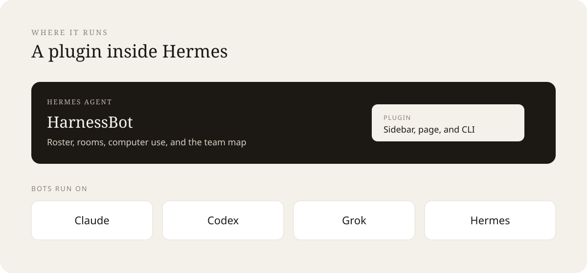
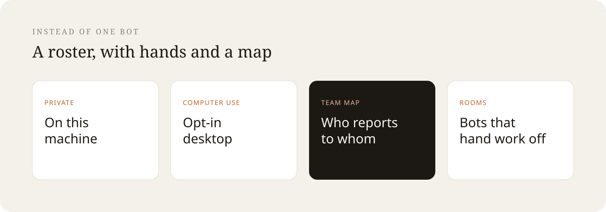
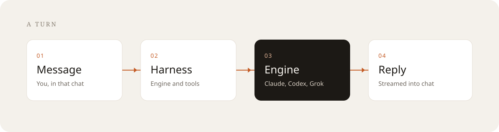
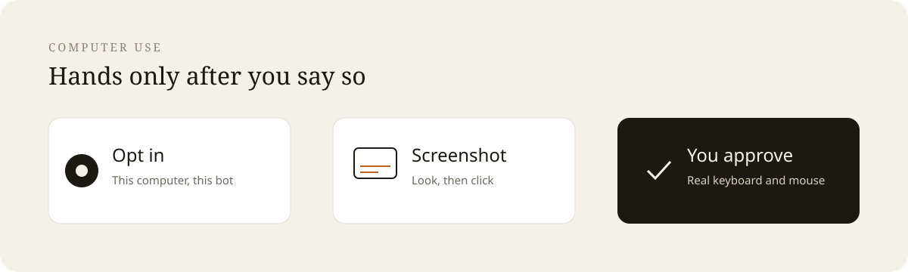

# HarnessBot

Open-source alternative to Grokbot. It works as a plugin inside Hermes Agent, and
each bot can run on Claude, Codex, Grok, or Hermes.

One assistant that forgets who it is is the thing this replaces. You get a roster of
named bots — computer use, a team map, rooms, and memory — on your machine. It is
**not affiliated with xAI**, it has **no token and no cryptocurrency**, and nothing
is behind a paywall. Apache-2.0.

```
pnpm install
pnpm dev:all          # harness on 127.0.0.1:8799, UI on 127.0.0.1:5199
open http://127.0.0.1:5199
```

You need at least one agent CLI installed and logged in (`claude`, `codex`, `grok`,
`cursor-agent`, …). HarnessBot runs the CLIs you already pay for; it does not proxy
them, and it does not ask you to create an account.

## Features and benefits

HarnessBot is the open-source Grokbot alternative that lives where you already work.
Install it as a plugin inside Hermes and you get the full product: a sidebar entry,
a `/harnessbot` page, and `hermes harnessbot` on the command line. The same bots
also run on Claude, Codex, and Grok. Nothing is sent to an account HarnessBot owns.



| | What you get |
| --- | --- |
| **Inside Hermes** | The plugin starts the harness on that machine. Desktop, dashboard, and CLI all open the same roster. |
| **Your engines** | Point a bot at Claude, Codex, Grok, or Hermes. HarnessBot does not replace the CLI you already pay for. |
| **Computer use** | A desktop only after you place one and opt in. Screenshot first, then click. You can take the wheel back. |
| **Team map** | Reporting lines, peers, and handoffs you draw. Open a bot’s chat from the map without leaving it. |





A turn is four steps:

1. **Message.** You write in that bot’s chat, or mention it in a room.
2. **Harness.** The plugin’s harness picks the engine, the folder, and only the tools that bot may use.
3. **Engine.** Claude, Codex, Grok, or Hermes does the work.
4. **Reply.** Text, tool activity, and any approval card stream back into the same thread.



Computer use stays a separate choice from chat:

1. **Opt in.** Choose This computer and confirm that this bot may use the real screen, keyboard, and mouse.
2. **Screenshot.** The bot looks first, then clicks, types, or opens a page.
3. **You approve.** Actions on the real computer ask in the chat. Opening a site is not signing in. The bot stops at a login wall instead of typing a password or a one-time code.

## What it actually does

- **Bots are contacts.** Pin, mark unread, duplicate, hide, file into sections. Each
  one has a persona, a model, a working folder, memory, and its own tool grants.
- **Tasks are clean slates.** A task is an independent conversation with its own
  transcript, provider session, resume cursor, usage, and pinned folder.
- **Approvals happen in chat.** Shell commands and file edits become cards with
  Allow / Deny / answer. "Always allow" is a narrow key (`Bash:git`), never a blanket
  grant, and grants for your real computer live in a separate memory from cloud ones.
  Every answer — including the ones nobody gave — is in the decision log under Settings.
- **Memory you can read and correct.** Structured entries per bot and per section, each
  showing its kind, source and confidence. Anything a bot inferred can be edited or
  deleted, and bots cannot write to a section's shared memory without your grant.
- **Rooms and teams.** Multi-bot rooms with `@mentions`, a bulletin, turn timeouts, a
  shared desk, org chart, Chief of Staff, and whole teams importable from one
  Markdown file.
- **Hands, on purpose.** Cloud desktop (Box or your own VPS), Local VM over
  Docker/Podman, this computer (opt-in), a built-in browser, connected apps over
  Composio, custom MCP servers, and physical Android over USB. Each placement states
  its own consequences, and expanded workspaces let you take over a VM desktop or a
  browser tab in the main column.
- **A team map you can actually draw on.** The reporting spine and the working graph
  are drawn differently on purpose: one manager per bot on the spine, plus dotted
  lines, peers, handoffs, and numbered workflow steps you create by dragging between
  cards. Pan, zoom, snap, tidy layout, and saved views. Double-click any bot to open
  its conversation in the side drawer without leaving the chart.
- **Automation.** Weekday or one-off routines that start a *fresh* task, plus webhooks
  that fire one from outside — created, rotated and revoked from Settings, on a
  receiver that runs on its own port.
- **Voice.** ElevenLabs TTS on the harness, per-bot voices, macOS dictation and calls.

## Where things live

| Path | What |
| --- | --- |
| `server/contracts.ts` | The architecture in one file: driver SPI + `RuntimeEvent` |
| `server/harness/` | Registry (configs → live instances or unavailable shadows) and the event bus |
| `server/drivers/` | One entry per provider; `builtIn.ts` is the table |
| `server/store.ts` | Persistence, and the single persistence → SSE joint |
| `server/index.ts` | The whole HTTP + SSE API, plain `node:http` |
| `src/` | React app. No transports of its own |
| `electron/` | Desktop shell, gated native capabilities |
| `scripts/mcp-server.mjs` | Bounded MCP control plane for Cursor / Claude Desktop |

Your data lives in `~/.harnessbot` (override with `HB_DATA_DIR`): `bots.json`,
`groups.json`, `config.json`, `messages.db` (SQLite WAL, owner-only), per-thread
NDJSON event logs, memory, skills, and attachments.

## Architecture in one paragraph

Two processes. The React app holds **no** agent transports: it sends typed HTTP
commands and folds **one** SSE stream into **one** reducer. The harness owns every
agent CLI, normalises each vendor's protocol into canonical `RuntimeEvent` objects,
persists through a store that emits a `StoreChange` on every write, and maps those
changes to SSE in exactly one place. That single joint is why "persisted but not
shown" and "shown but not persisted" cannot both exist.

## Safety model

The harness binds `127.0.0.1` and has **no authentication** — the trust boundary is
your OS user account. That is a deliberate design, and it is also why:

- Binding it off-machine is a vulnerability, not a feature. If you need internet
  delivery, tunnel **only** the webhook port.
- The webhook receiver runs on its own port and serves only `/health` and
  `/hooks/:secret`. It cannot reach `/api/bots`.
- Non-loopback `Host` headers are refused (DNS-rebinding defence).
- Secrets are write-only through the API. `GET /api/config` returns booleans.
- Everything a bot authored is scrubbed of content-shaped secrets before storage.
  What *you* type is stored exactly as you typed it.
- Ubuntu Wayland host control is disabled and legacy opt-ins are cleared. Preview is
  not permission, and Auto never reaches for your real desktop.
- Team packages never carry credentials, conversations, permissions, memory, or
  computer access. Imported members start with connections off and routines paused.

Found a vulnerability? See [SECURITY.md](SECURITY.md) — please don't open a public
issue.

## Commands

| Command | What it does |
| --- | --- |
| `pnpm dev:all` | Harness + Vite together |
| `pnpm dev:server` / `pnpm dev` | Just one of them |
| `pnpm dev:desktop` | Electron against the running dev server |
| `pnpm typecheck` | App + server `tsc` |
| `pnpm test` | Vitest: unit, driver contract, API smoke |
| `pnpm verify` | typecheck + test + contrast + i18n + Electron syntax |
| `pnpm check:contrast` | WCAG AA check across every shipping skin |
| `pnpm build:server` | Bundle the harness for packaging |
| `pnpm mcp` | The stdio MCP server (the app must be running) |

## Platforms

macOS is the primary target. Windows works (the installer is not code-signed yet, so
SmartScreen will warn). Ubuntu 24.04 GNOME is beta: Xorg host control is opt-in and
overlay-free; Wayland host control is disabled.

Dictation and calls are macOS-only right now, and the UI does not pretend otherwise.

## License

Apache-2.0. See [LICENSE](LICENSE).
